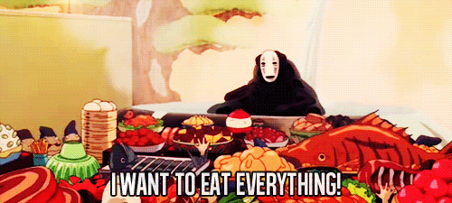

# Project: Diet Menu Generator

## Table of Contents

- [Project Overview](#project-overview)
- [Features](#features)
- [Live Demo](#live-demo)
- [Technologies Used](#technologies-used)
- [Explore the Code](#explore-code)

---

<h2 id="project-overview">Project Overview</h2>

**Healthy Bites** is a simple and responsive web app that helps users discover random meals tailored to their dietary preferences and meal type (breakfast, lunch, dinner). By connecting to the Spoonacular API, it generates curated recipe suggestions complete with images, summaries, and links to full instructions.

This project was created to explore working with third-party APIs, asynchronous JavaScript, and responsive UI design.

---

<h2 id="features">Features</h2>

- 🍽 Choose from various **diet types** (e.g., vegan, paleo, ketogenic)
- 🕘 Filter by **meal time** (breakfast, lunch, dinner)
- ⚡ Fetches random meals using the **Spoonacular API**
- 📸 Displays **images**, summaries, and links to full recipes
- 📱 **Mobile responsive** and user-friendly layout
- ✅ Includes **error handling** for failed API calls

---

<h2 id="live-demo">Live Demo</h2>

Explore the project in action below. This live version allows users to generate meals based on dietary preferences and meal types using real-time data from the Spoonacular API.

 

---

<h2 id="technologies-used">Technologies Used</h2>

- **HTML5** & **CSS3**
- **Vanilla JavaScript (ES6+)**
- [**Spoonacular API**](https://spoonacular.com/food-api)
- **Responsive Design**
- **Google Fonts** – [Fira Sans](https://fonts.google.com/specimen/Fira+Sans)

---

<h2 id="explore-code">Explore the Code</h2>

This project was originally built some time ago as a fun way to practise working with APIs and build something interactive. While I’m not actively maintaining it, feel free to explore, fork, or build on it if you'd like to take it further!

The core files include:

- `index.html` – handles the layout and structure
- `styles.css` – styles the interface, including responsive design
- `scripts.js` – fetches random meals from the Spoonacular API based on user selections

Pull requests or experiments welcome — or just poke around and enjoy!
